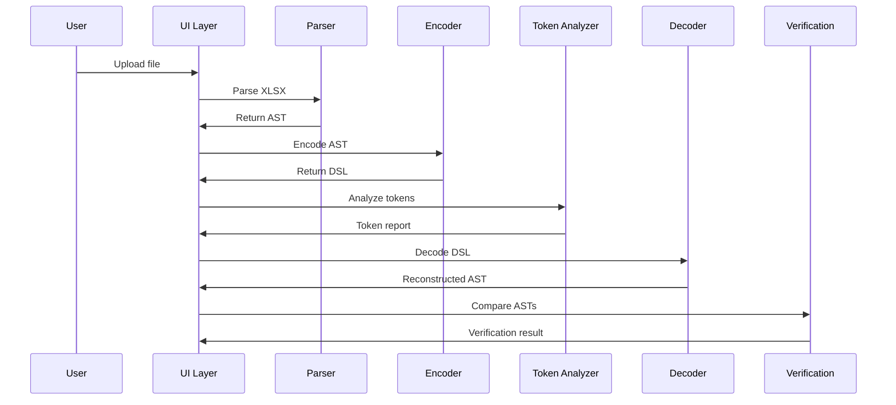
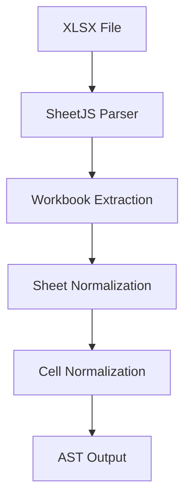
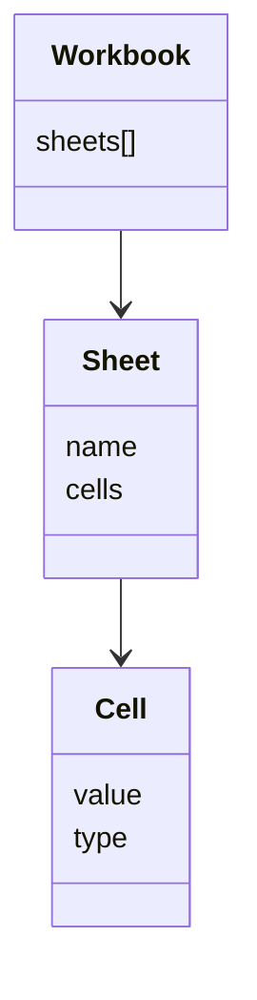
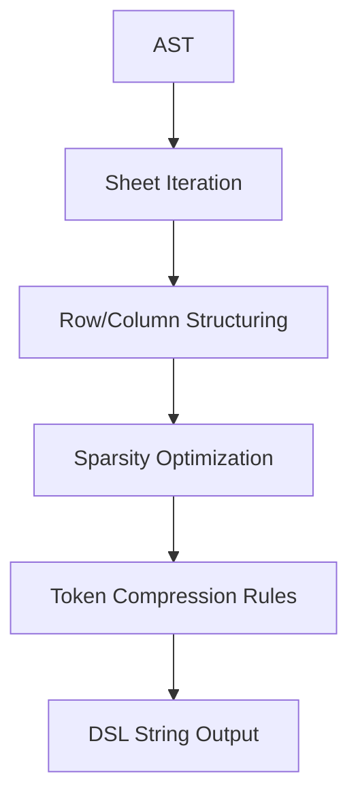
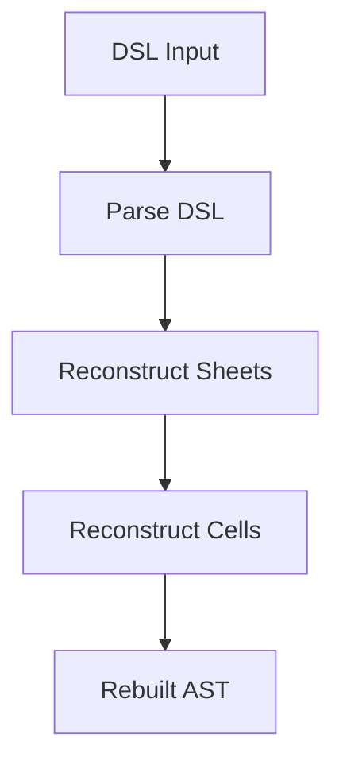
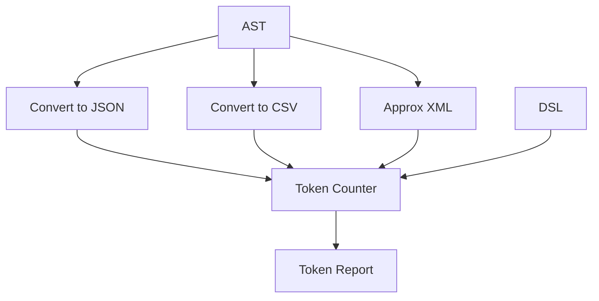
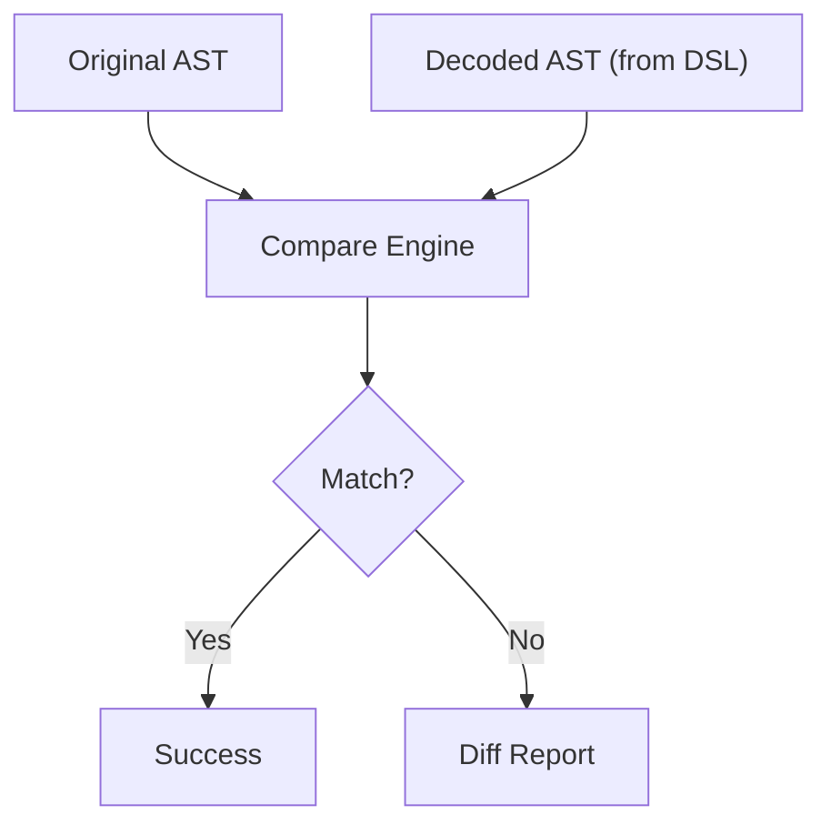
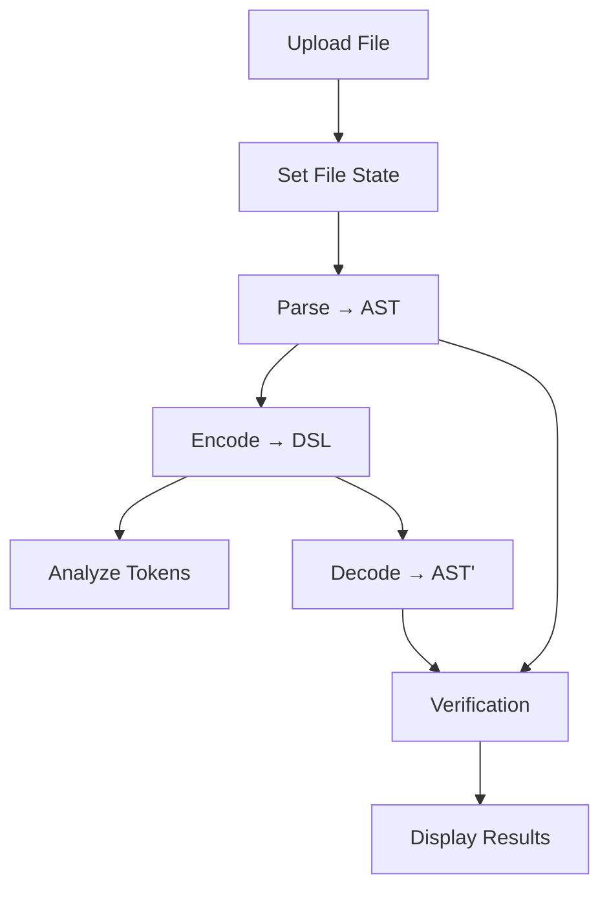
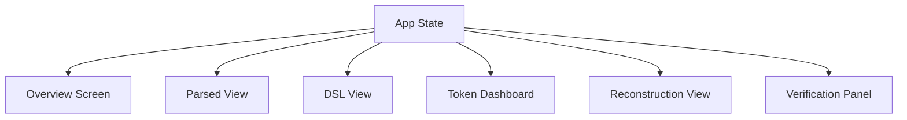
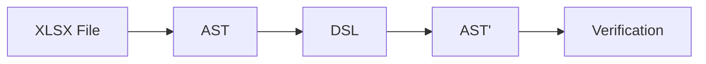

# ARCHITECTURE — XLSX Encoding Lab

## 1. System Overview

```mermaid
flowchart TD
  A[Upload XLSX] --> B[Parser]
  B --> C[AST (Canonical Model)]
  C --> D[Encoder (XLSXDSL1)]
  D --> E[DSL Output]

  C --> F[Token Analyzer]
  E --> F

  E --> G[Decoder]
  G --> H[Reconstructed AST]

  C --> I[Verification Engine]
  H --> I

  H --> J[Export XLSX]
````

---

## 2. Core Principle

> The system revolves around a **canonical AST (Abstract Syntax Tree)**

All transformations go through:

```mermaid
flowchart LR
  A[XLSX] --> B[AST]
  B --> C[DSL]
  C --> D[AST']
  D --> E[XLSX]
```

---

## 3. Pipeline Flow



---

## 4. Parser Architecture



### Notes

* Removes Excel-specific quirks
* Produces deterministic structure
* Outputs canonical AST

---

## 5. AST Structure (Conceptual)



---

## 6. Encoder Flow (DSL Generation)



### Responsibilities

* deterministic ordering
* compact representation
* reversible structure

---

## 7. Decoder Flow



### Requirement

* Must be fully symmetric with encoder

---

## 8. Token Analysis Flow



---

## 9. Verification Flow



Formula text, values, types, and sheet layout are compared here. **Reconstruction export** (downloading an `.xlsx`) is separate and does not replace this step.

---

## 10. Application State Flow



---

## 11. UI Architecture



---

## 12. Encoder Abstraction (Extensibility)

```mermaid
flowchart TD
  A[AST] --> B{Select Encoder}
  B --> C[XLSXDSL1]
  B --> D[XLSXDSL2 (future)]
  B --> E[JSON Compact]

  C --> F[DSL Output]
  D --> F
  E --> F
```

---

## 13. Data Flow Summary



---

## 14. Key Architectural Decisions

* **AST as single source of truth**
* **Pure function pipeline**
* **Deterministic encoding/decoding**
* **Pluggable encoder system**
* **Local-first processing**

---

## 15. Future Architecture Extensions

* streaming parser for large files
* plugin system for encoding strategies
* LLM integration layer
* API/server mode

```